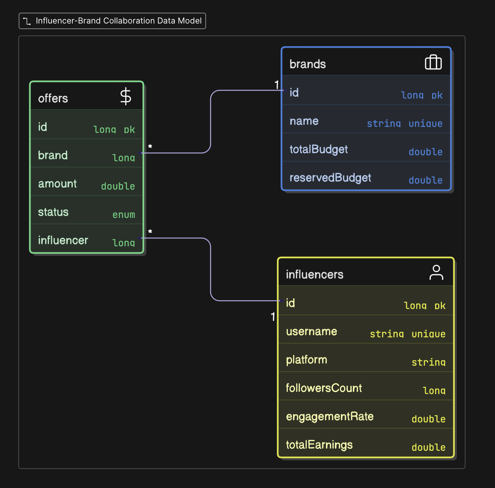
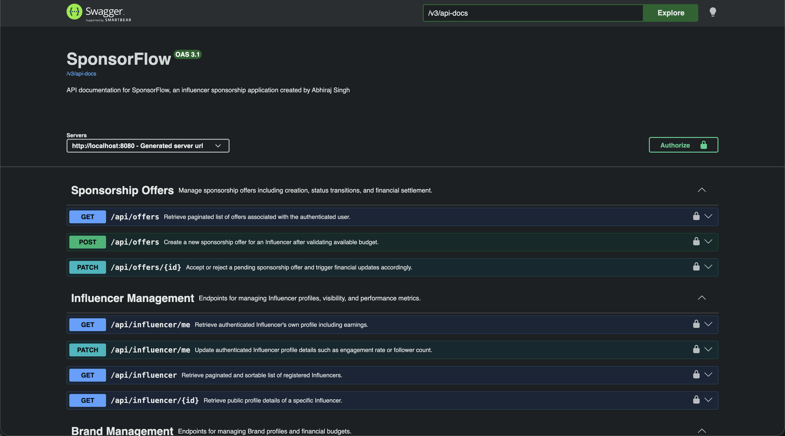

<div align="center">

  <h1>💸 SponsorFlow API</h1>

  <p>
    A banking-grade RESTful marketplace connecting Brands and Influencers. <br />
    Built with <strong>Java 21</strong>, <strong>Spring Boot 3</strong>, and <strong>MySQL</strong>.
  </p>

  <p>
    <a href="https://github.com/abhiraj-21/SponsorFlow/graphs/contributors">
      
    </a>
    <a href="https://github.com/abhiraj-21/SponsorFlow/network/members">
      
    </a>
    <a href="https://github.com/abhiraj-21/SponsorFlow/stargazers">
      
    </a>
    <a href="https://github.com/abhiraj-21/SponsorFlow/blob/master/LICENSE">
      
    </a>
  </p>

  <h4>
    <a href="#-tech-stack">Tech Stack</a> •
    <a href="#-key-features">Features</a> •
    <a href="#-getting-started">Getting Started</a> •
    <a href="#-api-documentation">API Docs</a>
  </h4>
</div>

---

## 📖 About The Project

**SponsorFlow** is a secure backend engine designed to manage the complete lifecycle of influencer sponsorships. Unlike simple CRUD apps, this system implements complex financial transactions, guaranteeing that budget reservations and payments are handled atomically.

It solves critical marketplace challenges:
* **Two-Table Authentication:** Seamlessly handles distinct entities (`Brand` vs `Influencer`) with a unified JWT security layer.
* **Financial Integrity:** Prevents "double-spending" by implementing a **Reserved vs. Available** budget system using `BigDecimal` precision.
* **Context-Aware Security:** Eliminates IDOR vulnerabilities by deducing user identity strictly from the security context, not URL parameters.

---

## 🛠 Tech Stack

| Component | Technology |
| :--- | :--- |
| **Language** | Java 21 |
| **Framework** | Spring Boot 3 (Web, Security, Data JPA) |
| **Database** | MySQL 8.0 |
| **Security** | Spring Security, JWT (JJWT), BCrypt |
| **Docs** | Swagger / OpenAPI 3 |
| **Validation** | Hibernate Validator |
| **Utils** | Lombok, MapStruct |

---

## Data Model


## 🚀 Key Features

### 🔐 Advanced Security
* **Multi-Role Auth:** Distinct registration and login flows for `/api/auth/register/brand` and `/api/auth/register/influencer`.
* **Smart Inboxes:** Context-aware data fetching. `GET /api/offers` automatically returns "Sent Offers" for Brands and "Inbox" for Influencers based on the JWT role.
* **Role-Based Access Control:** Strict `@PreAuthorize` gates ensure Influencers cannot see Brand wallets and Brands cannot edit Influencer profiles.

### 💰 Transactional Offer Engine
* **Reservation Logic:** When an offer is created, funds are moved from `Available` to `Reserved` immediately.
* **Atomic Transactions:** Utilizing `@Transactional`, money only leaves the Brand's total budget when an Influencer **ACCEPTS**.
* **Rejection Handling:** If an Influencer **REJECTS**, reserved funds are automatically released back to the Brand's available pool.

### 📊 Profile & Budget Management
* **Brand Wallet:** Brands can add funds to their `TotalBudget`, but the system automatically calculates `AvailableBudget` based on active offers.
* **Influencer Analytics:** Tracks `TotalEarnings` automatically as offers are accepted.
* **Privacy Mode:** DTOs are designed to hide sensitive financial data (like Total Budget) when a profile is viewed by a third party.

---

## 🏁 Getting Started

Follow these steps to set up the project locally.

### Prerequisites
* Java Development Kit (JDK) 21
* Maven 3.8+
* MySQL Server running on port `3306`

### Installation

1.  **Clone the Repository**
    ```bash
    git clone https://github.com/abhiraj-21/SponsorFlow.git
    cd SponsorFlow
    ```

2.  **Configure Database**
    * Create a database named `sponsorflow_db` in MySQL Workbench or CLI:
        ```sql
        CREATE DATABASE sponsorflow_db;
        ```
    * Update `src/main/resources/application.properties` with your credentials:
        ```properties
        spring.datasource.username=root
        spring.datasource.password=your_password
        spring.jpa.hibernate.ddl-auto=update
        ```

3.  **Build and Run**
    ```bash
    mvn spring-boot:run
    ```

4.  **Access the Application**
    The server will start at `http://localhost:8080`.

---

## 🔌 API Documentation

Detailed API documentation is available via **Swagger UI** once the application is running. It includes live testing and schema descriptions.

> **URL:** [http://localhost:8080/swagger-ui/index.html](http://localhost:8080/swagger-ui/index.html)

### Quick Reference



| Method | Endpoint | Description | Access |
| :--- | :--- | :--- | :--- |
| **Auth** | | | |
| `POST` | `/api/auth/register/brand` | Register a new Brand | Public |
| `POST` | `/api/auth/login/influencer` | Login as Influencer | Public |
| **Offers** | | | |
| `POST` | `/api/offers` | Create financial offer | Brand |
| `GET` | `/api/offers` | View Inbox / Sent Items | Authenticated |
| `PATCH` | `/api/offers/{id}` | Accept or Reject Offer | Influencer |
| **Profiles** | | | |
| `GET` | `/api/influencers/me` | View own earnings & stats | Influencer |
| `PATCH` | `/api/brands/me` | Add funds to budget | Brand |

---

## 🤝 Contributing

Contributions are what make the open source community such an amazing place to learn, inspire, and create. Any contributions you make are **greatly appreciated**.

1.  Fork the Project
2.  Create your Feature Branch (`git checkout -b feature/AmazingFeature`)
3.  Commit your Changes (`git commit -m 'Add some AmazingFeature'`)
4.  Push to the Branch (`git push origin feature/AmazingFeature`)
5.  Open a Pull Request

---

## 📜 License

Distributed under the MIT License. See `LICENSE` for more information.

---

<div align="center">
  <p>Made with ❤️ by <strong>Abhiraj Singh</strong></p>
  <a href="https://github.com/abhiraj-21">
    
  </a>
  <a href="https://www.linkedin.com/in/abhiraj07">
    
  </a>
</div>
